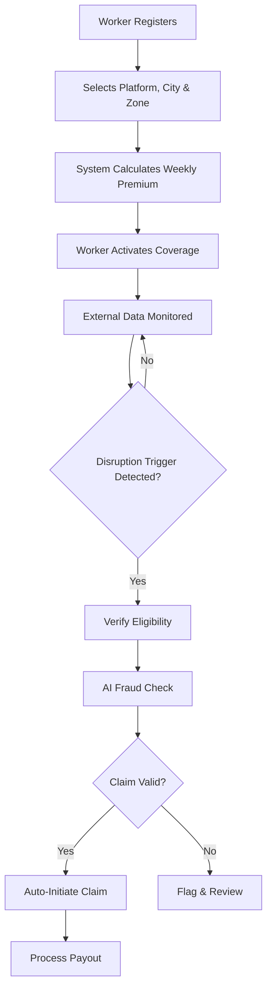

# 🛡️ GigShield AI

> **Weekly Parametric Insurance for India's Gig Delivery Workers**

GigShield AI protects gig delivery workers from income loss caused by external disruptions — heavy rain, extreme heat, flooding, pollution, strikes, or curfews. Coverage is automatic, event-based, and priced weekly to match how gig workers earn.

[]()
[]()

---

## 📋 Table of Contents

- [Problem Statement](#-problem-statement)
- [Target Personas](#-target-personas)
- [System Architecture](#-system-architecture)
- [Workflow](#-workflow)
- [Weekly Premium Model](#-weekly-premium-model)
- [Parametric Triggers](#-parametric-triggers)
- [AI/ML Integration](#-aiml-integration)
- [Tech Stack](#-tech-stack)
- [Database Schema](#-database-schema)
- [API Endpoints](#-api-endpoints)
- [Development Plan](#-development-plan)
- [Getting Started](#-getting-started)
- [Environment Variables](#-environment-variables)
- [Contributing](#-contributing)

---

## 🔍 Problem Statement

Delivery partners in India often lose working hours and daily income due to conditions outside their control — monsoon rains, heatwaves, urban flooding, poor air quality, or sudden curfews. Traditional insurance is too slow and manual for this use case.

**GigShield AI solves this by offering automatic, event-based income protection with simple weekly pricing — no claim forms, no delays.**

---

## 👤 Target Personas

### Persona 1: Food Delivery Worker
> *A Swiggy/Zomato delivery partner working daily in a city like Chennai*

- Needs **low-cost weekly protection** that fits a daily wage cycle
- Loses income during rain, heat, and traffic disruption
- Wants **quick payout without filing manual claims**

### Persona 2: Grocery / Q-Commerce Worker
> *A Blinkit/Zepto delivery partner operating in dense urban zones*

- Faces sudden blockages, curfews, and heavy rain
- Needs **fast and transparent coverage**
- Prefers **mobile-first access** and instant alerts

---

## 🏗️ System Architecture

```
┌─────────────────────────────────────────────────────────────────────────────────┐
│                              GIGSHIELD AI PLATFORM                              │
└─────────────────────────────────────────────────────────────────────────────────┘

┌──────────────┐     ┌──────────────────────────┐     ┌────────────────────────┐
│              │     │                          │     │   Auth Middleware       │
│  React.js    │────▶│  Express API             │────▶│   JWT + Role-Based     │
│  Frontend    │     │  Controllers + Routes    │     │   Access Control       │
│  (Vite)      │◀────│                          │     │   (Worker / Admin)     │
│              │     │                          │     └────────────────────────┘
└──────────────┘     └──────────┬───────────────┘
                                │
                    ┌───────────▼───────────────┐
                    │                           │
                    │  Services & Business      │
                    │  Logic Layer              │
                    │                           │
                    └───────────┬───────────────┘
                                │
         ┌──────────────────────┼──────────────────────┐
         │                      │                      │
         ▼                      ▼                      ▼
┌─────────────────┐  ┌──────────────────┐  ┌──────────────────────┐
│  External APIs  │  │  AI/ML Engine    │  │  Payment Gateway     │
│  ─────────────  │  │  ──────────────  │  │  ──────────────────  │
│  • Weather API  │  │  • Premium Calc  │  │  • Razorpay Sandbox  │
│  • AQI API      │  │  • Fraud Detect  │  │  • Auto Payouts      │
│  • Flood Alerts │  │  • Risk Scoring  │  │  • Txn Tracking      │
│  • Traffic API  │  │  (Python/Sklearn)│  │                      │
└─────────────────┘  └──────────────────┘  └──────────────────────┘
                                │
                    ┌───────────▼───────────────┐
                    │                           │
                    │     MongoDB Database      │
                    │                           │
                    └───────────┬───────────────┘
                                │
        ┌──────────┬────────────┼────────────┬───────────┐
        ▼          ▼            ▼            ▼           ▼
   ┌─────────┐ ┌────────┐ ┌─────────┐ ┌──────────┐ ┌─────────┐
   │ Workers │ │Policies│ │ Claims  │ │ Triggers │ │ Payouts │
   └─────────┘ └────────┘ └─────────┘ └──────────┘ └─────────┘
```

### Architecture Overview

The platform follows a **layered architecture** pattern with clear separation of concerns:

| Layer | Technology | Responsibility |
|-------|-----------|----------------|
| **Presentation** | React.js + Vite | Worker & Admin dashboards, responsive UI |
| **API Gateway** | Express.js + TypeScript Controllers | RESTful routes, request validation, response formatting |
| **Auth Middleware** | JWT + Role Checks | Token verification, role-based access (Worker / Admin) |
| **Service Layer** | Node.js Business Logic | Premium calculation, claim processing, trigger evaluation |
| **AI/ML Engine** | Python + Scikit-learn | Risk scoring, fraud detection, premium recommendation |
| **External APIs** | Weather, AQI, Traffic | Real-time trigger data from third-party sources |
| **Payment** | Razorpay (Sandbox) | Premium collection, automated payout processing |
| **Data Layer** | MongoDB | Persistent storage for all platform entities |

### Data Flow

```
Worker Registration ──▶ Profile Created ──▶ Risk Assessment (AI/ML)
         │
         ▼
  Policy Activation ──▶ Premium Payment ──▶ Coverage Starts
         │
         ▼
  Trigger Monitoring ──▶ Event Detected ──▶ Eligibility Check
         │                                         │
         ▼                                         ▼
  Fraud Detection (AI) ──▶ Claim Auto-Created ──▶ Payout Processed
```

---

## ⚙️ Workflow



1. **Register** — Worker signs up, selects delivery platform (Swiggy, Zomato, Blinkit, etc.), city, and work zone.
2. **Premium Calculation** — System calculates weekly premium based on zone risk, weather history, and disruption frequency.
3. **Activate Coverage** — Worker pays the weekly premium to activate coverage.
4. **Monitor Triggers** — External APIs are continuously monitored for disruption events.
5. **Trigger Detection** — If a parametric trigger fires (e.g., rainfall > threshold), eligibility is checked.
6. **Fraud Check** — AI/ML rules validate the claim against suspicious patterns.
7. **Auto-Payout** — If valid, the claim is auto-initiated and payout is processed instantly.

---

## 💰 Weekly Premium Model

The policy uses a **weekly pricing model** because gig workers earn weekly and need flexible, affordable coverage.

| Risk Zone | Weekly Premium (₹) | Coverage Payout (₹) |
|-----------|--------------------|-----------------------|
| 🟢 Low Risk | ₹29 – ₹49 | Up to ₹500 |
| 🟡 Medium Risk | ₹49 – ₹79 | Up to ₹750 |
| 🔴 High Risk | ₹79 – ₹129 | Up to ₹1,000 |

### Premium Factors

- **Location risk score** — Based on historical disruption data
- **Weather patterns** — Monsoon frequency, heat index, flood history
- **Platform density** — Number of active delivery workers in zone
- **Claim frequency** — Past claim rate in the area
- **Seasonal adjustments** — Higher risk during monsoon, lower in dry season

---

## 🌧️ Parametric Triggers

Coverage is triggered **only by measurable external events** that directly affect income. The system pays based on the event trigger — no manual claim submission required.

| Trigger | Condition | Data Source |
|---------|-----------|-------------|
| 🌧️ Heavy Rainfall | > 50mm in 3 hours | Weather API (OpenWeatherMap) |
| 🌡️ Extreme Heat | > 45°C sustained | Weather API |
| 🌫️ Air Pollution | AQI > 300 (Hazardous) | AQI API (AQICN) |
| 🌊 Flood Alert | Official flood warning issued | Government Disaster API |
| 🚫 Curfew / Strike | Zone closure confirmed | News API / Manual Admin |
| 🚗 Traffic Blockage | Major route blocked > 4 hours | Traffic API (mock) |

---

## 🤖 AI/ML Integration

### 1. Premium Calculation Engine
A lightweight ML model estimates weekly risk and recommends premium values.

**Inputs:**
- Historical weather data for the zone
- Past disruption frequency
- Worker activity patterns
- Platform density metrics

**Model:** Gradient Boosted Decision Trees (Scikit-learn)

### 2. Fraud Detection System
Real-time detection of suspicious claim patterns.

**Detection Rules:**
- 🔴 Duplicate claims from same worker in overlapping windows
- 🔴 Fake GPS / location spoofing signals
- 🔴 Claims during verified inactive periods
- 🔴 Abnormal trigger patterns (e.g., claims only at payout boundaries)

**Model:** Anomaly detection using Isolation Forest + rule-based filters

### 3. Risk Analytics Dashboard
Visual analytics for platform administrators.

- 📊 High-risk zone heatmaps
- 📈 Predicted disruption trends (7-day forecast)
- 📉 Claim frequency and payout trend analysis
- 🗺️ Geographic risk distribution

---

## 🛠️ Tech Stack

| Category | Technology | Purpose |
|----------|-----------|---------|
| **Frontend** | React.js + Vite | Worker & Admin dashboards |
| **Routing** | React Router | Client-side navigation |
| **Backend** | Node.js + Express.js | REST API server |
| **Database** | MongoDB + Mongoose | Data persistence & ODM |
| **AI/ML** | Python + Scikit-learn | Premium calc, fraud detection |
| **Weather Data** | OpenWeatherMap API | Rain, temperature triggers |
| **Air Quality** | AQICN API | AQI-based triggers |
| **Payments** | Razorpay (Test Mode) | Premium collection & payouts |
| **Auth** | JWT + bcrypt | Authentication & authorization |
| **Deployment** | Vercel (Frontend) / Render (Backend) | Cloud hosting |

---

## 🗄️ Database Schema

```
┌──────────────────┐     ┌──────────────────┐     ┌──────────────────┐
│     Workers      │     │    Policies      │     │     Claims       │
│──────────────────│     │──────────────────│     │──────────────────│
│ _id              │◀───▶│ _id              │◀───▶│ _id              │
│ name             │     │ workerId (FK)    │     │ policyId (FK)    │
│ phone            │     │ city             │     │ triggerId (FK)   │
│ email            │     │ zone             │     │ status           │
│ platform         │     │ premiumAmount    │     │ payoutAmount     │
│ city             │     │ coverageAmount   │     │ fraudScore       │
│ zone             │     │ riskLevel        │     │ verifiedAt       │
│ aadharHash       │     │ startDate        │     │ processedAt      │
│ isActive         │     │ endDate          │     │ createdAt        │
│ createdAt        │     │ status           │     └──────────────────┘
└──────────────────┘     │ createdAt        │
                         └──────────────────┘
┌──────────────────┐     ┌──────────────────┐
│    Triggers      │     │    Payouts       │
│──────────────────│     │──────────────────│
│ _id              │     │ _id              │
│ type             │     │ claimId (FK)     │
│ city             │     │ workerId (FK)    │
│ zone             │     │ amount           │
│ threshold        │     │ method           │
│ actualValue      │     │ razorpayTxnId    │
│ source           │     │ status           │
│ detectedAt       │     │ processedAt      │
│ severity         │     │ createdAt        │
└──────────────────┘     └──────────────────┘
```

---

## 🔌 API Endpoints

### Auth
| Method | Endpoint | Description |
|--------|----------|-------------|
| `POST` | `/api/auth/register` | Register new worker |
| `POST` | `/api/auth/login` | Login and get JWT |
| `GET` | `/api/auth/me` | Get current user profile |

### Policies
| Method | Endpoint | Description |
|--------|----------|-------------|
| `POST` | `/api/policies/calculate` | Calculate premium for zone |
| `POST` | `/api/policies/activate` | Activate weekly coverage |
| `GET` | `/api/policies/:id` | Get policy details |
| `GET` | `/api/policies/worker/:id` | Get all policies for worker |

### Claims
| Method | Endpoint | Description |
|--------|----------|-------------|
| `GET` | `/api/claims` | List all claims (admin) |
| `GET` | `/api/claims/:id` | Get claim details |
| `GET` | `/api/claims/worker/:id` | Get claims for a worker |
| `POST` | `/api/claims/auto-process` | Trigger auto-claim processing |

### Triggers
| Method | Endpoint | Description |
|--------|----------|-------------|
| `GET` | `/api/triggers` | List all active triggers |
| `POST` | `/api/triggers/check` | Check triggers for a zone |
| `GET` | `/api/triggers/history/:zone` | Get trigger history |

### Admin / Analytics
| Method | Endpoint | Description |
|--------|----------|-------------|
| `GET` | `/api/admin/dashboard` | Dashboard summary stats |
| `GET` | `/api/admin/risk-zones` | Risk zone analytics |
| `GET` | `/api/admin/payouts` | Payout reports |

---

## 📅 Development Plan

### Phase 1: Research & Design ✅
- [x] Finalize target personas
- [x] Define weekly pricing model
- [x] Create system architecture
- [x] Prepare README and documentation

### Phase 2: Core Product 🚧
- [ ] Build registration and onboarding flow
- [ ] Implement policy activation with premium payment
- [ ] Add parametric trigger monitoring logic
- [ ] Create basic claim auto-processing pipeline
- [ ] Integrate Weather & AQI APIs

### Phase 3: Advanced Features 🔮
- [ ] Train and deploy fraud detection model
- [ ] Simulate instant payout via Razorpay sandbox
- [ ] Build worker dashboard (policy status, claims, payouts)
- [ ] Build admin dashboard (analytics, risk zones, approvals)
- [ ] Add push notification system for trigger alerts
- [ ] Final demo polish and presentation

---

## 🚀 Getting Started

### Prerequisites

- Node.js >= 18.x
- Python >= 3.9
- MongoDB (local or Atlas)
- npm or yarn

### Installation

```bash
# Clone the repository
git clone https://github.com/your-username/GigShieldAI.git
cd GigShieldAI

# Install backend dependencies
cd server
npm install

# Install frontend dependencies
cd ../client
npm install

# Install ML dependencies
cd ../ml
pip install -r requirements.txt
```

### Running Locally

```bash
# Start MongoDB (if local)
mongod

# Start the backend server
cd server
npm run dev

# Start the frontend (in a new terminal)
cd client
npm run dev

# Run the ML service (in a new terminal)
cd ml
python app.py
```

The frontend will be available at `http://localhost:5173` and the API at `http://localhost:5000`.

---

## 🔐 Environment Variables

Create a `.env` file in the `/server` directory:

```env
# Server
PORT=5000
NODE_ENV=development

# Database
MONGODB_URI=mongodb://localhost:27017/gigshield

# Auth
JWT_SECRET=your_jwt_secret_key
JWT_EXPIRES_IN=7d

# External APIs
OPENWEATHER_API_KEY=your_openweather_key
AQICN_API_KEY=your_aqicn_key

# Razorpay
RAZORPAY_KEY_ID=your_razorpay_key
RAZORPAY_KEY_SECRET=your_razorpay_secret

# ML Service
ML_SERVICE_URL=http://localhost:8000
```

---

## 🤝 Contributing

1. Fork the repository
2. Create your feature branch (`git checkout -b feature/amazing-feature`)
3. Commit your changes (`git commit -m 'Add amazing feature'`)
4. Push to the branch (`git push origin feature/amazing-feature`)
5. Open a Pull Request


---

## 🙏 Acknowledgements

- [OpenWeatherMap](https://openweathermap.org/) — Weather data API
- [AQICN](https://aqicn.org/) — Air quality data
- [Razorpay](https://razorpay.com/) — Payment gateway
- [Scikit-learn](https://scikit-learn.org/) — ML framework

